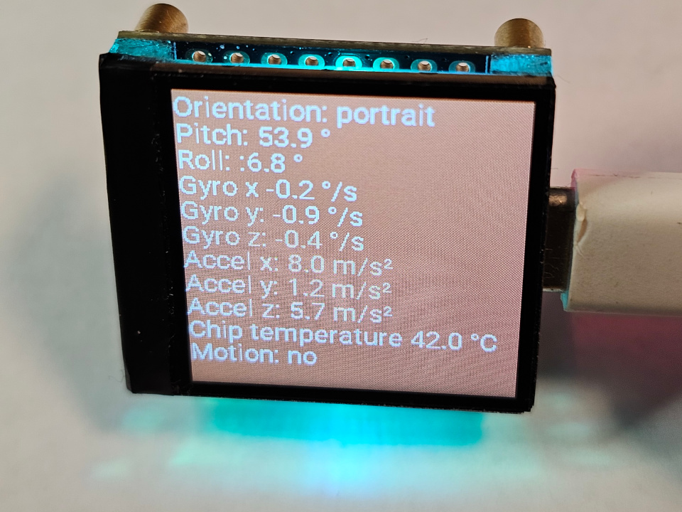
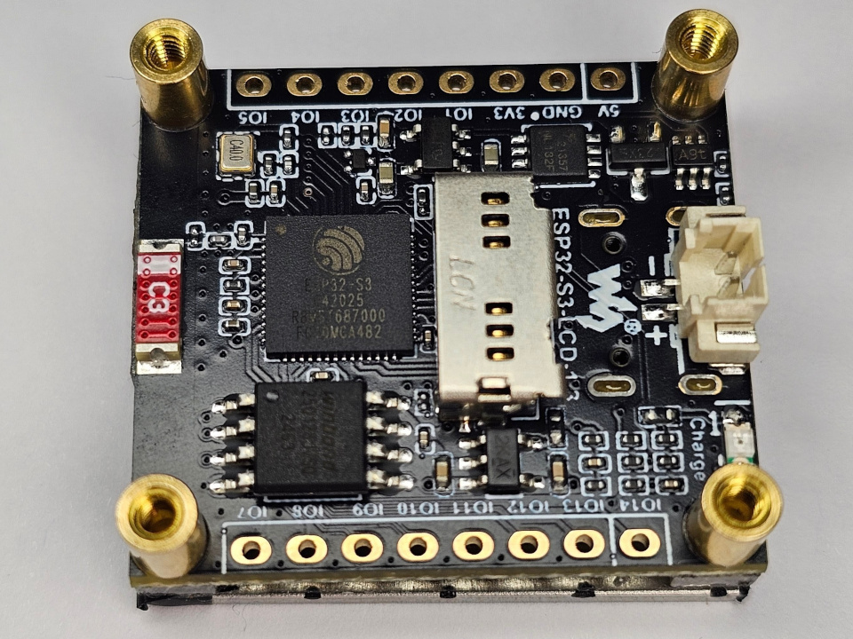
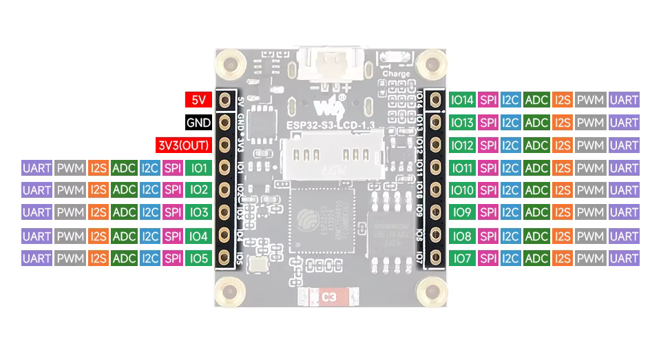

# ESPHome for Spotpear ESP32-S3-LCD-1.3

Template for your own Esphome projects. Feel free to use the arfilliate links below to support me!

Buy [Spotpear ESP32-S3-LCD-1.3](https://s.click.aliexpress.com/e/_c4rHj723) from AliExpress

ESPHome [yaml file](display3.yaml) 

Features:
- ESP32 S3 with 8MB PSRAM
- LCD Display 1.3" 240x240 (ST7789V)
- Accelerometer/Gyroscope (QMI8658)
- RGB Led (WS2812)
- 13 GPIO
- Battery connector and Li-Ion/LiPo Charger (TP4054)
- SD Card slot *
- Flash 128MB (W25Q128) * 

*) Not in my ESPHome template

Download [Shematics pdf](doc/schematic_esp32_s3_lcd_1.3.pdf) 